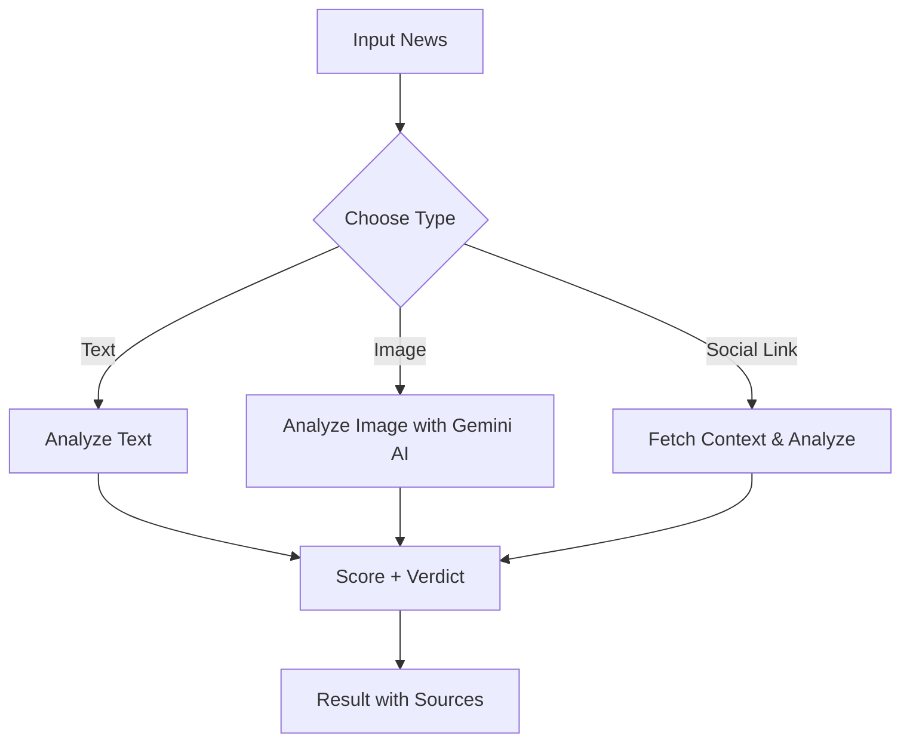

# 🛡️ Truth Guardian AI - Fake News Detection

  
_Advanced AI-powered tool to detect fake news from **Text**, **Social Media**, and **Images** in real-time._

[](https://fake-news-detection-inky.vercel.app/)
[](#-browser-extension)
[](#-streamlit-app)
[](https://github.com/colddsam/Fake-News-Detection/issues)
[](https://github.com/colddsam/Fake-News-Detection/network/members)
[](https://github.com/colddsam/Fake-News-Detection/stargazers)
[](https://github.com/colddsam/Fake-News-Detection/blob/main/LICENSE)
[](https://github.com/colddsam/Fake-News-Detection/archive/refs/heads/main.zip)

---

## 📸 Preview


---

## 📚 Table of Contents

- [🛡️ Truth Guardian AI - Fake News Detection](#️-truth-guardian-ai---fake-news-detection)
  - [📸 Preview](#-preview)
  - [📚 Table of Contents](#-table-of-contents)
  - [✅ Features](#-features)
  - [🧠 How it Works](#-how-it-works)
  - [🧰 Tech Stack](#-tech-stack)
  - [🛠️ Next Website Setup](#️-next-website-setup)
    - [⚙️ Create `.env.local`](#️-create-envlocal)
  - [📊 Streamlit App](#-streamlit-app)
    - [🚀 Run Streamlit Locally](#-run-streamlit-locally)
    - [✨ Features](#-features-1)
  - [🐍 FastAPI Backend](#-fastapi-backend)
  - [🧩 Browser Extension](#-browser-extension)
    - [🔧 Installation](#-installation)
  - [🧾 SEO Configuration](#-seo-configuration)
  - [📁 Folder Structure](#-folder-structure)
  - [🤝 Contributing](#-contributing)
  - [📜 License](#-license)
  - [✨ Author](#-author)

---

## ✅ Features

| Category         | Description                                                              |
| ---------------- | ------------------------------------------------------------------------ |
| 🔍 Text Checker   | Detects manipulated or misleading text using NLP and ML                  |
| 🖼️ Image Checker  | Uses Gemini AI to analyze image authenticity                             |
| 🧵 Social Checker | Cross-verifies social media claims using real-time search engine results |
| 🌐 Browser Ext.   | Chrome Extension to detect fake news directly on websites and posts      |
| 📊 Streamlit App  | Lightweight Python-based app interface for simple testing and analysis   |
| 🐍 Python API     | FastAPI backend for serving fake news detection APIs (text/image/social) |
| 📈 Realtime Data  | Live AI scoring system with contextual feedback                          |
| ⚙️ SEO Optimized  | Auto-generated sitemap, robots.txt, meta description                     |

---

## 🧠 How it Works



---

## 🧰 Tech Stack

| Layer       | Technology                           |
| ----------- | ------------------------------------ |
| 💻 Frontend  | React.js, Next.js, TailwindCSS       |
| 📊 Streamlit | Python Streamlit for UI + testing    |
| ⚙️ Backend   | Next.js API Routes, FastAPI (Python) |
| 🧠 AI        | Google Gemini API                    |
| 🌐 Extension | Chrome Extension (Manifest V3)       |
| ☁️ Hosting   | Vercel (Frontend), Render (Backend)  |

---

## 🛠️ Next Website Setup

```bash
git clone https://github.com/colddsam/Fake-News-Detection.git
cd Fake-News-Detection/website
npm install
npm run dev
```

Visit: `http://localhost:3000`

### ⚙️ Create `.env.local`

```env
GEMINI_API_KEY=your_gemini_api_key
ALLOWED_EXTENSION_ORIGIN=chrome-extension://your-extension-id
NEXT_PUBLIC_BASE_URL=https://yourappdomain.com
```

---

## 📊 Streamlit App

The Streamlit app is a minimal interface built for testing and rapid prototyping. Located in the `frontend/` directory.

### 🚀 Run Streamlit Locally

```bash
cd Fake-News-Detection/frontend
pip install -r requirements.txt
streamlit run app.py
```

Open in browser: `http://localhost:8501`

### ✨ Features

* Simple UI to test text, image, and social media inputs
* Sends requests to the FastAPI backend
* Displays AI-based scoring and verdicts
* Lightweight and easy to modify

---

## 🐍 FastAPI Backend

```bash
cd Fake-News-Detection/backend
python3 -m venv venv
source venv/bin/activate  # on Windows: venv\Scripts\activate
pip install -r requirements.txt
uvicorn main:app --reload
```

> Backend will run at `http://localhost:8000`

---

## 🧩 Browser Extension

### 🔧 Installation

1. Visit `chrome://extensions/`
2. Enable **Developer Mode**
3. Click **Load Unpacked**
4. Select the `extension/` folder

---

## 🧾 SEO Configuration

Defined inside `layout.tsx` (Next.js):

```ts
export const metadata = {
  title: "Truth Guardian AI - Fake News Detection",
  description: "Advanced AI tool to detect fake news from text, social media, and images",
};
```

Other SEO tools:

* `next-sitemap` for sitemap & robots
* Optimized metadata & OG tags

---

## 📁 Folder Structure

```

Fake-News-Detection
├── backend/                   # FastAPI Backend
│   ├── main.py
│   ├── search.py
│   ├── verify.py
│   ├── utils.py
│   └── requirements.txt
├── frontend/                 # Streamlit App (New)
│   ├── app.py
│   └── requirements.txt
├── extension/                # Browser Extension
│   ├── icons/
│   ├── config.js
│   ├── manifest.json
│   ├── popup.css
│   ├── popup.html
│   └── popup.js
├── website/                  # Next.js Frontend
│   ├── app/
│   │    └──api/
│   ├── public/
│   ├── styles/
│   ├── next.config.mjs
│   ├── package.json
│   └── ...
├── LICENSE
├── README.md
├── content.png
└── preview.png
```

---

## 🤝 Contributing

We welcome contributions! To get started:

1. **Fork** the repository
2. Create a new branch: `git checkout -b feature/your-feature-name`
3. Commit your changes: `git commit -m "Added something cool"`
4. Push to the branch: `git push origin feature/your-feature-name`
5. Open a **Pull Request**

---

## 📜 License

This project is licensed under the [Apache License](https://github.com/colddsam/Fake-News-Detection/blob/main/LICENSE)

---

## ✨ Author

**Samrat Kumar Das**
[](https://www.linkedin.com/in/colddsam/)

---
